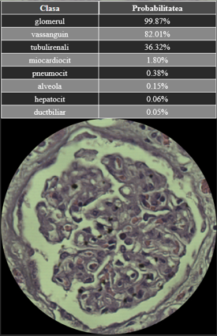
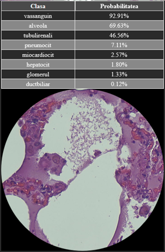
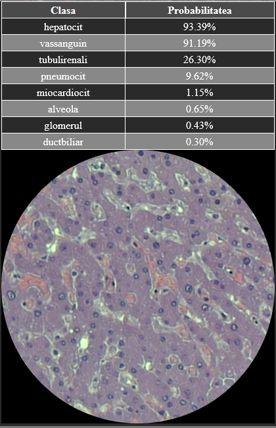

# Project Bichat

This is my M.D. thesis, an in-browser object detection application, supposedly somewhat good at recognizing histological slides. Created with react, tensorflow.js (wasm backend) and [react-avatar-edit](https://www.npmjs.com/package/react-avatar-edit).

## Available Scripts

In the project directory, you can run:

### `npm start`

Runs the app in the development mode.\
Open [http://localhost:3000](http://localhost:3000) to view it in your browser.

### `npm run build`

Builds the app for production to the `build` folder.\
It correctly bundles React in production mode and optimizes the build for the best performance.
The build is minified and the filenames include the hashes.\
You can then place the contents of the build folder in the "html" folder of [nginx](http://nginx.org/en/download.html) or apache.